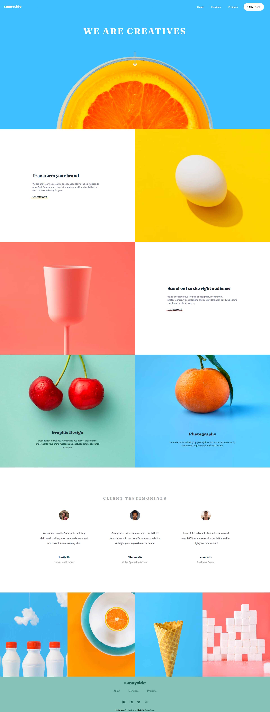

[](https://github.com/thalesAlves758/sunnyside-agency-landing-page/blob/master/README.md)

# Frontend Mentor - Sunnyside agency landing page solution

This is a solution to the [Sunnyside agency landing page challenge on Frontend Mentor](https://www.frontendmentor.io/challenges/sunnyside-agency-landing-page-7yVs3B6ef). Frontend Mentor challenges help you improve your coding skills by building realistic projects.

## Table of contents

- [Overview](#overview)
  - [The challenge](#the-challenge)
  - [Screenshot](#screenshot)
    - [Desktop Layout](#desktop-layout)
    - [Mobile Layout](#mobile-layout)
    - [Mobile Layout - Opened Menu](#mobile-layout---opened-menu)
  - [Links](#links)
- [My process](#my-process)
  - [Built with](#built-with)
  - [Useful resources](#useful-resources)
  - [Steps to run locally](#steps-to-run-locally)
    - [Setup](#setup)
    - [Execution](#execution)
- [Author](#author)

## Overview

### The challenge

Users should be able to:

- View the optimal layout for the site depending on their device's screen size
- See hover states for all interactive elements on the page

### Screenshot

#### Desktop Layout



#### Mobile Layout


#### Mobile Layout - Opened Menu


### Links

- Live Site URL: [Sunnyside agency landing page](https://sunnyside-agency-landing-page-silk-zeta.vercel.app/)

## My process

### Built with

- Semantic HTML5 markup
- Flexbox
- Sass/Scss
- JavaScript

### Useful resources

- [Sass documentation](https://sass-lang.com/) - Official Sass documentation

### Steps to run locally

#### Setup

1. Clone the project in a local directory:
```bash
git clone https://github.com/thalesAlves758/sunnyside-agency-landing-page
```

2. Download the development dependencies (in this case is Sass):
```bash
npm i
```

⚠️**Notes**:
- Make sure you have Node installed on your computer.

#### Execution

1. Once the installation has been done correctly, run the following command to generate the .css files:
```bash
npm run sass:watch
```

2. Open the index.html file. If you are using vscode, it's recommended to use the extension [Live Server](https://marketplace.visualstudio.com/items?itemName=ritwickdey.LiveServer) to make it easier.

That's it, the landing page is running locally. 🙂

## Author

- Frontend Mentor - [@thalesAlves758](https://www.frontendmentor.io/profile/thalesAlves758)
- GitHub - [@thalesAlves758](https://github.com/thalesAlves758)