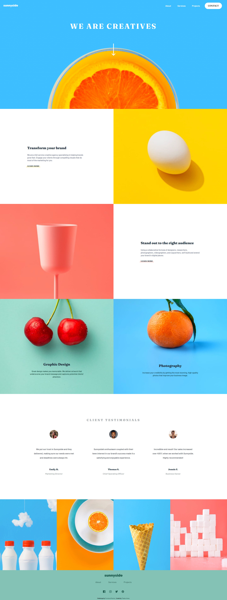
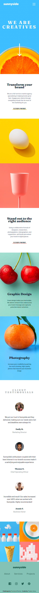
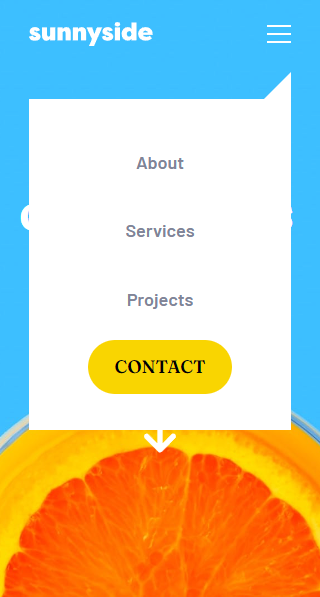

[](https://github.com/thalesAlves758/sunnyside-agency-landing-page/blob/master/README.en.md)

# Frontend Mentor - Sunnyside agency landing page

Esta é uma solução para o desafio [Sunnyside agency landing page challenge no Frontend Mentor](https://www.frontendmentor.io/challenges/sunnyside-agency-landing-page-7yVs3B6ef). Os desafios do Frontend Mentor ajudam você a melhorar suas habilidades de codificação, construindo projetos realistas.

## Índice

- [Visão Geral](#visão-geral)
  - [O desafio](#o-desafio)
  - [Captura de tela](#captura-de-tela)
    - [Desktop Layout](#desktop-layout)
    - [Mobile Layout](#mobile-layout)
    - [Mobile Layout - Menu aberto](#mobile-layout---menu-aberto)
  - [Links](#links)
- [Meu processo](#meu-processo)
  - [Construído com](#construído-com)
  - [Recursos úteis](#recursos-úteis)
  - [Passos para executar localmente](#passos-para-executar-localmente)
    - [Instalação](#instalação)
    - [Execução](#execução)
- [Autor](#autor)

## Visão Geral

### O desafio

Os usuários devem ser capazes de:

- Visualizar o layout ideal, dependendo do tamanho da tela do dispositivo
- Ver os estados de hover para todos os elementos interativos da página

### Captura de tela

#### Desktop Layout



#### Mobile Layout



#### Mobile Layout - Menu aberto



### Links

- URL do site ao vivo: [Sunnyside agency landing page](https://sunnyside-agency-landing-page-silk-zeta.vercel.app/)

## Meu processo

### Construído com

- HTML5 marcação semântica
- Flexbox
- Sass/Scss
- JavaScript

### Recursos úteis

- [Documentação do Sass](https://sass-lang.com/) - Documentação oficial do Sass

### Passos para executar localmente

#### Instalação

1. Clone o projeto em algum diretório local:
```bash
git clone https://github.com/thalesAlves758/sunnyside-agency-landing-page
```

2. Baixe as dependências de desenvolvimento (no caso o Sass):
```bash
npm i
```

⚠️**Observações**:
- Certifique-se de ter o Node instalado em seu computador.

#### Execução

1. Feita a instalação corretamente, execute o comando a seguir para gerar os arquivos .css:
```bash
npm run sass:watch
```

2. Abra o arquivo index.html. Caso esteja utilizando o vscode, é recomendável usar a extensão [Live Server](https://marketplace.visualstudio.com/items?itemName=ritwickdey.LiveServer) para facilitar.

Feito isso está pronto, a landing page está rodando localmente. 🙂

## Autor

- Frontend Mentor - [@thalesAlves758](https://www.frontendmentor.io/profile/thalesAlves758)
- GitHub - [@thalesAlves758](https://github.com/thalesAlves758)
